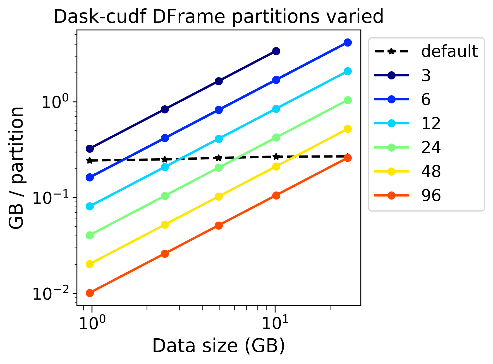
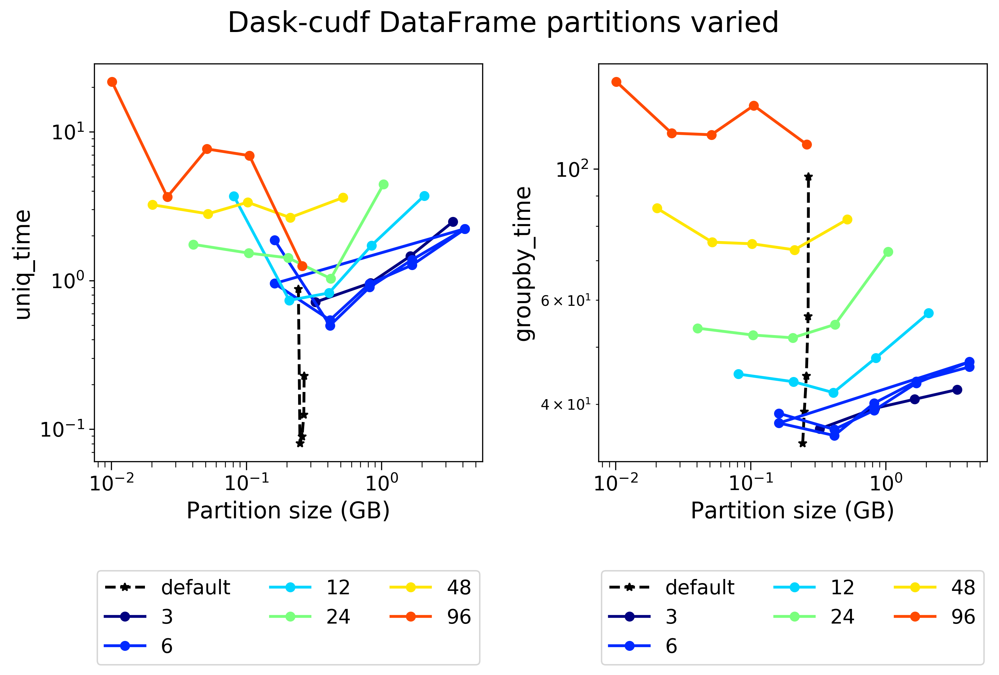
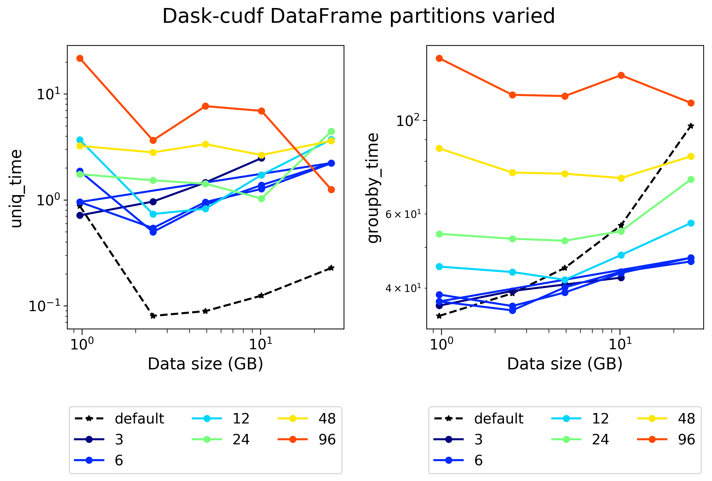
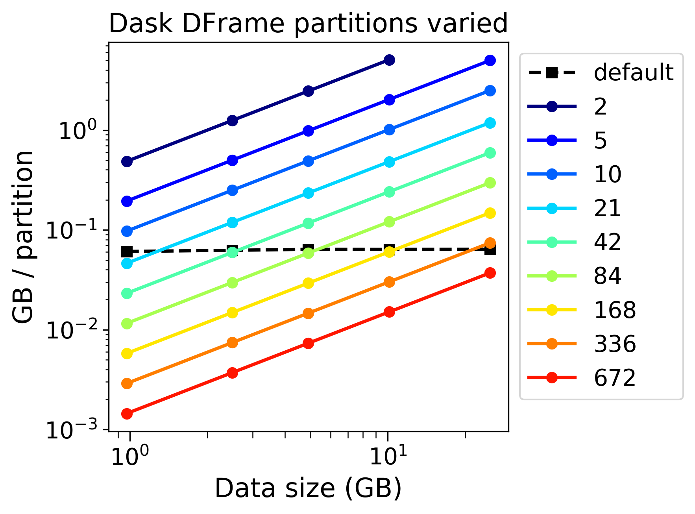
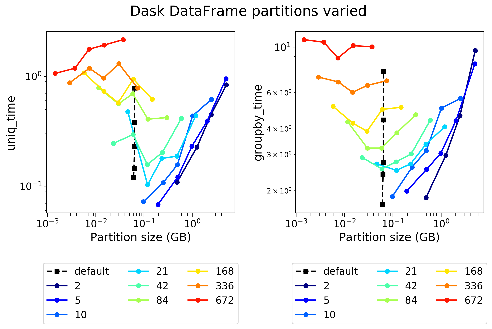
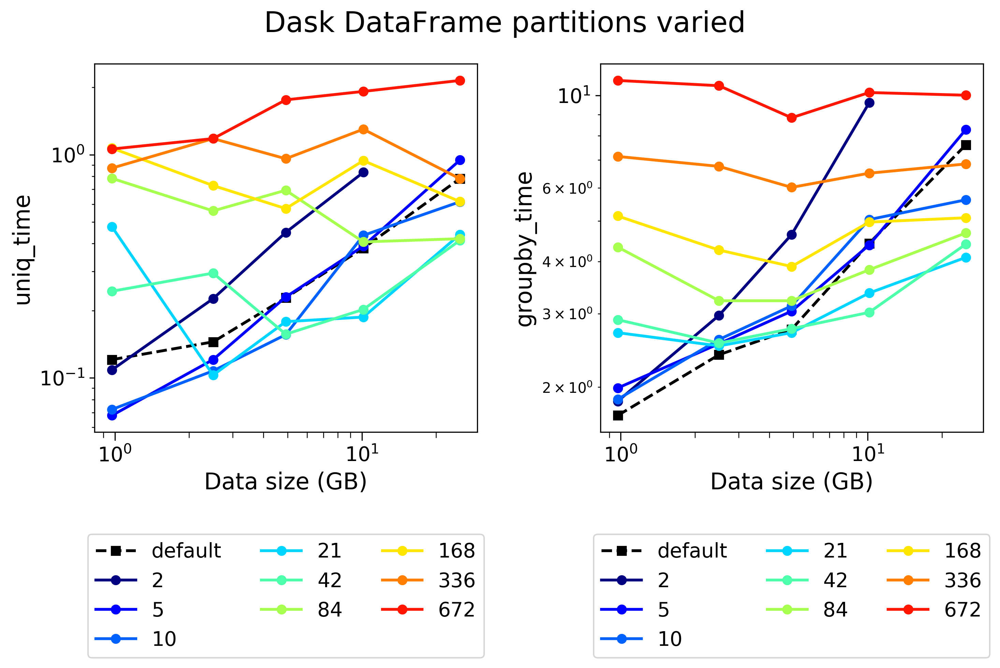

# Benchmarking cudf on Summit

## Running the benchmark

First, run the job script that provisions the dask scheduler and dask-cuda workers shown [elsewhere](https://github.com/benjha/nvrapids_olcf/blob/branch-0.11/dask-cuda-batch/launch_dask_cuda_cluster.lsf) in this repository.

Next, run benchmarking script as: 

```bash
python cudf_benchmarking.py <task> <package> <size>
```

Provide inputs as:
* `task`: 
  * `groupby` based on [this](https://github.com/mrocklin/dask-gpu-benchmarks/blob/master/groupby-aggregations.ipynb) notebook
  * `join-indexed` based on [this](https://github.com/mrocklin/dask-gpu-benchmarks/blob/master/join-indexed.ipynb) notebook
* `package`:
  * `dask`
  * `dask-cudf`
  * `cudf`
  * `pandas`
* `size`:
  * `all`
  * `1G`
  * `2.5G`
  * `5G`
  * `10G`
  * `25G`
  * more to come ...

## 1. Groupby Results

### 1.1. Baseline 

**Figure 1**: Summary of durations for (left) loading a csv file, (center) calculate the number of unique values, and (right) groupby on a single column using the ``pandas`` package that is capable of only using one CPU socket (IBM Power 9 CPU in this case) and potentially multiple threads. 


**Figure 2**: Summary of durations for (left) loading a csv file, (center) calculate the number of unique values, and (right) groupby on a single column using the ``cudf`` package that is capable of using a single NVIDIA GPU (Volta V100 in this case).

### 1.2. Optimally reading a csv

Both `dask-cudf` and `dask` are capable of reading `.csv` files in blocks or chunks. Using the optimal block or chunk size can substantially change the speed with which large `.csv` files are read into memory. 


**Figure 3**: The `chunksize` parameter in `dask-cudf.read_csv()` was varied from `32 MB` to `4 GB`. Note that by default the `read_csv()` function reads with ~ `256 MB` chunk sizes. For obvious reasons, `chunksize`s larger than the size of the data file were not used in experiments. Also, very small chunk sizes relative to the size of the `csv` file were also not used. Figure 3 shows that the loading time varies inversely with the `chunksize` and directly with the number of effective `partitions`. Here `partitions` are the number of chunks dask chops the `csv` file and can be calculated as the quotient of the file size and the `chunksize`. Thus, it appears that the `chunksize` should be roughly 1/2 to 1/4 the size of the size of the file for the fastest loading time.


**Figure 4**: The `blocksize` parameter in `dask.dataframe.read_csv()` was varied from `32 MB` to `1 GB`. The trends obvserved and the inference gleaned from figure 3 apply to `dask` as well. 

### 1.3. Partitioning the dataframe to maximize performance

#### 1.3.1. Dask-cudf


**Figure 9**: Default chunk sizes 

 
**Figure 10**: 


**Figure 11**: 

#### 1.3.2. Dask


**Figure 12**: Default chunk sizes 

 
**Figure 13**: 


**Figure 14**: 

### 1.4. Comparing all packages

**Figure 1**: Summary of durations for (left) loading a csv file, (center) calculate the number of unique values, and (right) groupby on a single column. Results from experiments that use the best ``blocksize``, ``chunksize`` and ``parititons`` parameters are used in the above plots. Overall, the multi-threaded, dask-counterparts of the single-threaded (CPU-only) pandas and (NVIDIA GPU) cudf packages are substantially faster at reading the single csv file. 
