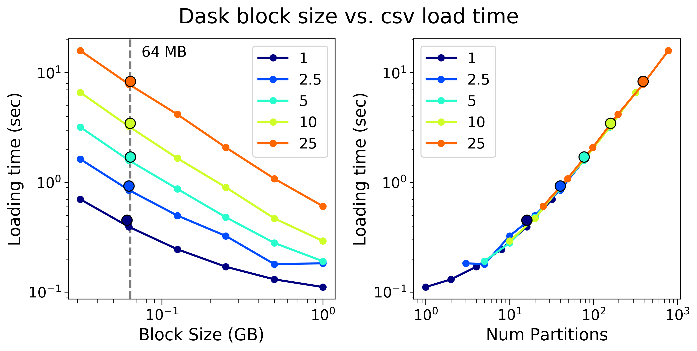
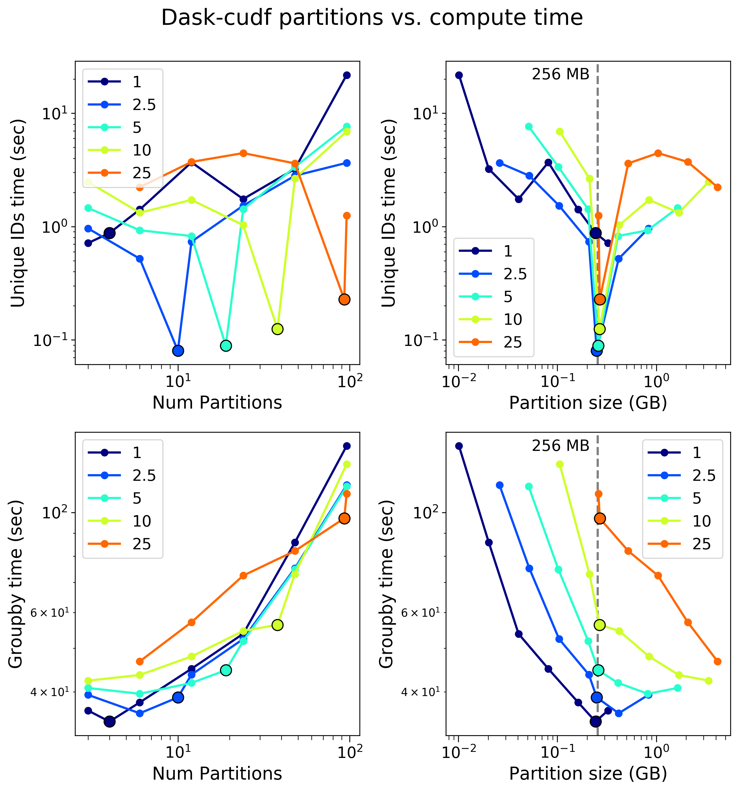

# Benchmarking cudf on Summit

## Running the benchmark

First, run the job script that provisions the dask scheduler and dask-cuda workers shown [elsewhere](https://github.com/benjha/nvrapids_olcf/blob/branch-0.11/dask-cuda-batch/launch_dask_cuda_cluster.lsf) in this repository.

Next, run benchmarking script as: 

```bash
python cudf_benchmarking.py <task> <package> <size>
```

Provide inputs as:
* `task`: 
  * `groupby` based on [this](https://github.com/mrocklin/dask-gpu-benchmarks/blob/master/groupby-aggregations.ipynb) notebook
  * `join-indexed` based on [this](https://github.com/mrocklin/dask-gpu-benchmarks/blob/master/join-indexed.ipynb) notebook
* `package`:
  * `dask`
  * `dask-cudf`
  * `cudf`
  * `pandas`
* `size`:
  * `all`
  * `1G`
  * `2.5G`
  * `5G`
  * `10G`
  * `25G`
  * more to come ...

## 1. Groupby Results

### 1.1. Baseline 

**Figure 1**: Summary of durations for (left) loading a csv file, (center) calculate the number of unique values, and (right) groupby on a single column using the ``pandas`` package that is capable of only using one CPU socket (IBM Power 9 CPU in this case) and potentially multiple threads. 


**Figure 2**: Summary of durations for (left) loading a csv file, (center) calculate the number of unique values, and (right) groupby on a single column using the ``cudf`` package that is capable of using a single NVIDIA GPU (Volta V100 in this case).

### 1.2. Optimally reading a csv

Both `dask-cudf` and `dask` are capable of reading `.csv` files in blocks or chunks. Using the optimal block or chunk size can substantially change the speed with which large `.csv` files are read into memory. 


**Figure 3**: The `chunksize` parameter in `dask-cudf.read_csv()` was varied from `32 MB` to `4 GB` for spreadsheets ranging from `1 GB` to `25 GB` as shown in the legend. For obvious reasons, `chunksize`s larger than the size of the data file were not used in experiments. Also, very small `chunksize`s relative to the size of the `csv` file were also not used. The figures show that the loading time varies inversely with the `chunksize` and directly with the number of effective `partitions`. Here `partitions` are the number of chunks dask chops the `csv` file and can be calculated as the quotient of the file size and the `chunksize`. Experiments with the default parameters (`chunksize` = `256 MB`) are shown as larger markers with a black border to separate them from experiments where the `chunksize` was manually altered. Thus, it appears that the `chunksize` should be roughly `1/2` to `1/4` the size of the size of the file for the fastest loading time. Since the default `chunksize` is fixed, the performance improvements of changing the `chunksize` are more pronunced as the dataframe size increases beyond `5 GB`.


**Figure 4**: The `blocksize` parameter in `dask.dataframe.read_csv()` was varied from `32 MB` to `1 GB` when reading  spreadsheets ranging from `1 GB` to `25 GB` as shown in the legend. For obvious reasons, `blocksize`s larger than the size of the data file were not used in experiments. Also, very small `blocksize`s relative to the size of the `csv` file were also not used. Note that, in these experiments, it was not possible to use `blocksize` greater than `1 GB`. The time to load spreadsheets varies inversely with the `blocksize`. Very substantial improvements to the loading time can be obtained by increasing the `blocksize` to the supposed maximum of `1 GB` from the default value of `64 MB`. 

### 1.3. Partitioning the dataframe to maximize performance


**Figure 5**: The dataframe was repartitioned after loading from csv to study the effects of such repartitoning on the time taken to compute the number of unique values in a particular column and performing a few groupby operations. Given that the experiments were run on `2` Summit nodes having a total of `12 GPUs`, the dataframes were partitioned into fractions or multiples of the number of GPUs since each dask-cuda worker was pinned to a single GPU and CPU core. In other words, the dataframe was partitioned into `3`, `6`, `12`, `24`, `48`, and `96` partitions. The size per partition was calculated as the quotient of the size of the csv file and the number of partitions. By default `dask-cudf` uses partitions that are `256 MB` in size and such data-points have been marked as large circles with black borders. The top right plot shows a very clear minima at ~ `256 MB` indicating that the best performance for finding the number of unique values in a column can only be achieved by using the default partitioning parameters. The plot on the bottom left indicates that the time required to perform the groupby operation varies directly with the number of partitions. However, having too few partitions (`3` in this case) can adversely affect the performance. The best performance was obtained when the dataset was partitioned to `1/2` the number of GPU workers (`6` in this case). Note that the performance difference between the best and worst partition sizes (studied in these epxeriments) can range over two orders of magnitude. in the case of the computatioanlly expensive groupby operation being studied here, the benefits of shrinking the number of partitions grows more substantially with the size of the dataset in question.

 
**Figure 6**: The dataframe was repartitioned after loading from csv to study the effects of such repartitoning on the time taken to compute the number of unique values in a particular column and performing a few groupby operations. Given that the experiments were run on `2` Summit nodes having a total of `84` dask workers (one pinned to each physical CPU core), the dataframes were partitioned into fractions or multiples of the total number of CPU cores. In other words, the dataframe was partitioned into `2`, `5`, `10`, `21`, `42`, `84`, `168`, `336`, and `672` partitions. The size per partition was calculated as the quotient of the size of the csv file and the number of partitions. By default `dask` uses partitions that are `64 MB` in size and such data-points have been marked as large circles with black borders. The top right plot shows that the time to find the unique entities in a column varies quadratically with the size of the paritions with a minima that itself increases slightly with the size of the dataframe. In other words, the best performance for a `1 GB` dataframe was obtained with a partiton size of `200 MB`, while that for a `25 GB` dataframe was obtained for partitions of size ~ `600 MB`. Similar trends are observed for the `groupby` operation as seen in the bottom right figure. Thus, modest improvements in computational performance can be obtained by shrinking the number of partitions such that the size of the partitions lie between `256 MB` and `1024 MB`. 

### 1.4. Comparing all packages

**Figure 7**: Summary of durations for (left) loading a csv file, (center) calculate the number of unique values, and (right) groupby on a single column. Results from experiments that use the best ``blocksize``, ``chunksize`` and ``parititons`` parameters are used in the above plots. Overall, the multi-threaded, dask-counterparts of the single-threaded (CPU-only) pandas and (NVIDIA GPU) cudf packages are substantially faster at reading the single csv file. 
